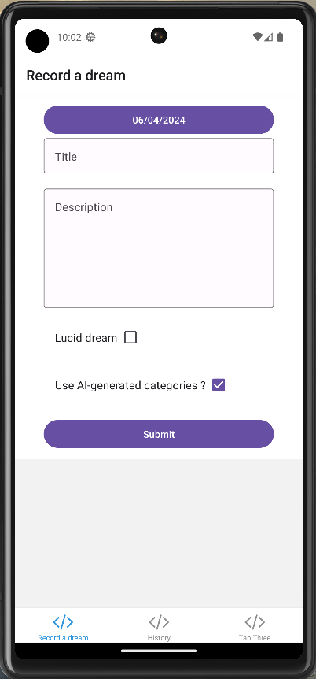
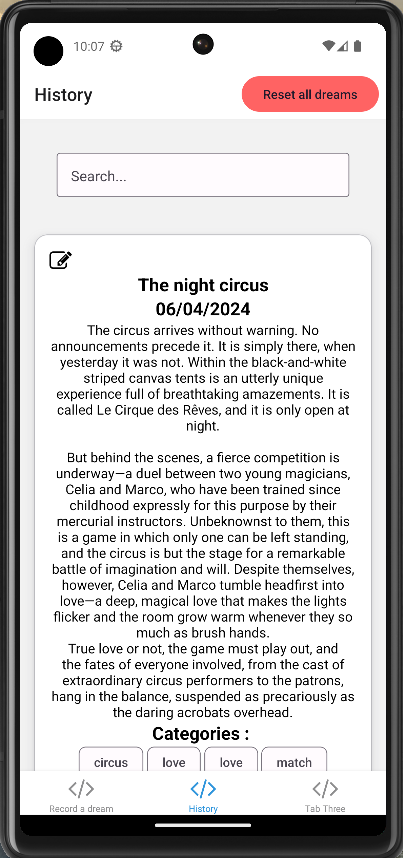
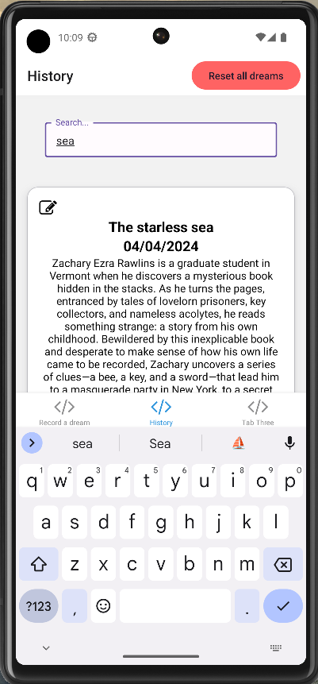
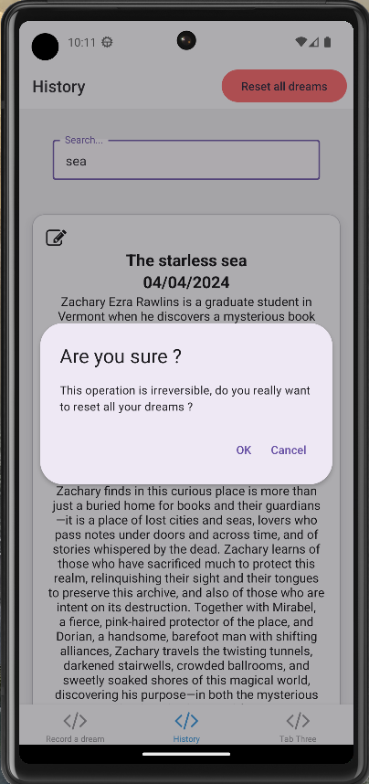
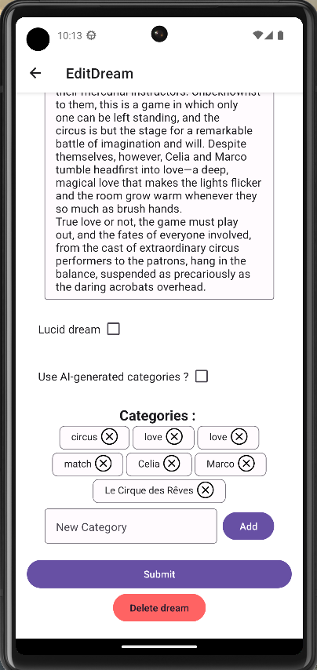

# Dream Report App

## Technical stack

This project uses React Native, TypeScript, graphic library React Native Paper and library AsyncStorage.

## Install and Launch

Create file `ApiKeyService.ts` and declare your MeaningCloud API Key, with function `getApiKey()`.  
Start project with `npx expo` command. Installation is managed by Expo.

## Implemented features

- Record a dream with form.  
    Custom fields are : 
    - title
    - description
    - is lucid
    - date
    - use AI-generated categories

    Categories cannot be written by the user on first record. Categories are either written by the AI or there are none.

    

- Call Meaning Cloud API on dream submission.

- Display dream historic, sorted by descending date.

    

- Search field on dream title in historic.

    

- Reset all dreams, with confirmation before deleting.

    

- Update a dream : 
    - Remove a category
    - Add a new category
    - Overwrite categories with AI categories, with confirmation before updating the dream
    - Update all other fields

    

- Delete a dream, with confirmation before deleting.

## Structure and architecture

### Tabs

Tabs are placed in `app/(tabs)` directory. One file represents one tab, but each tab needs to be called in file `app/(tabs)/_layout.tsx`.

Tabs implementation was done by Expo starter kit `expo-template-tabs`.

### AsyncStorage

AsyncStorage is used to simulate a back-end part, it stores datas locally on user's smartphone, asynchronously and not crypted.

Usage of AsyncStorages needs [installation](https://docs.expo.dev/versions/latest/sdk/async-storage/), that is already done on this project.

### Components

As in React, React Native uses components. They are placed in `components` directory. As for tabs, one file represents one component.

Components are built to be adaptable to the context, and be reusable. So they need to be supplied with parameters to be used everywhere in the project.
